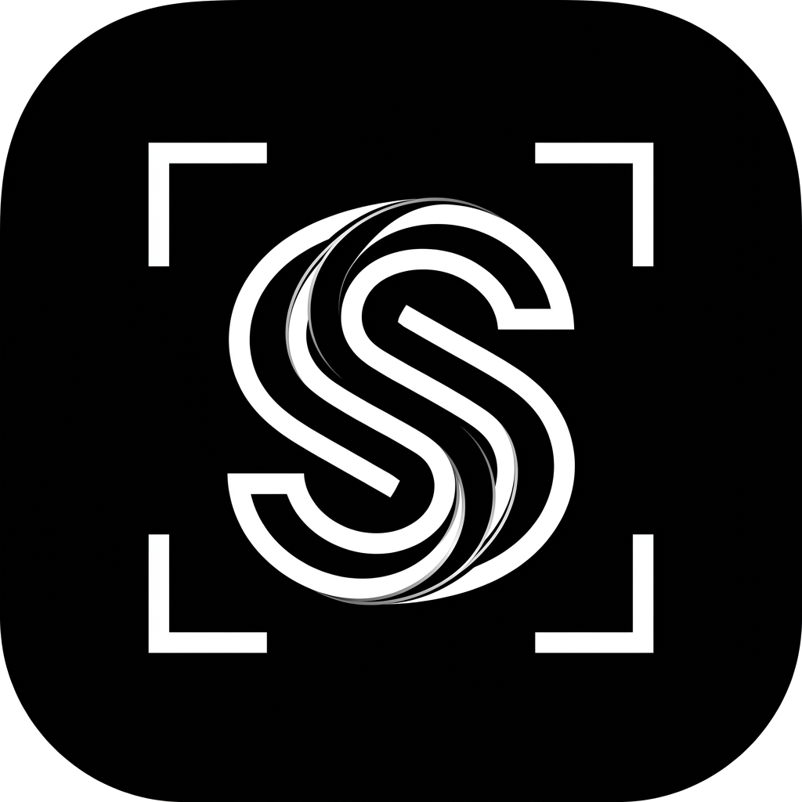

<p align="center">
  
</p>

<h1 align="center">snipsnap</h1>

<p align="center">
  <b>Fast, high-DPI desktop screen capture, rich vector annotations, on-device OCR, and local capture library.</b><br>
  Built with Flutter for macOS, Windows, and Linux. 100% private, offline-first, and zero telemetry.
</p>

<p align="center">
  <a href="https://github.com/bluegene37/snipsnap/actions/workflows/ci.yml"></a>
  <a href="https://flutter.dev"></a>
  <a href="LICENSE"></a>
  <a href="RELEASING.md"></a>
  <a href="#-downloads--installation"></a>
</p>

---

## ⚡ Key Features

- 📸 **High-DPI Region & Window Capture**: Multi-monitor global shortcut (`Cmd+Shift+X` / `Ctrl+Shift+X`) overlays seamlessly across full-screen apps and multiple displays with high-DPI coordinate scaling.
- ✏️ **Rich Vector Annotations**:
  - **Arrows & Double Arrows**: Precision arrows with customizable curve paths, line thickness, and arrowheads.
  - **Geometric Shapes**: Rectangles, rounded boxes, ellipses, and speech callout bubbles with stroke, fill, and opacity control.
  - **Highlighter & Freehand Pen**: Variable-width freehand ink and translucent highlight markers.
  - **Step Counter Badges**: Auto-incrementing numbered badges to easily document workflows and tutorials.
  - **Pixel Ruler**: Interactive on-screen measurement tool displaying physical pixel dimensions.
  - **Privacy Redaction**: Solid blackout, mosaic pixelation, and Gaussian blur to conceal credentials and sensitive data.
- 🔍 **On-Device OCR**: Instant text recognition powered by native Apple Vision Framework on macOS and `Windows.Media.Ocr` on Windows. Copy plain text or formatted table data in one click.
- 🗄️ **Local SQLite Capture Library**: All captures and annotations are stored locally via Drift & SQLite. Search history by date, tags, or OCR content. Zero cloud telemetry.
- 🎨 **Canvas Framing & Export**: Add background padding, drop shadows, window borders, or export to PNG, JPEG, and clipboard.

---

## 📦 Downloads & Installation

Pre-built binaries and installers are available on the [GitHub Releases](https://github.com/bluegene37/snipsnap/releases/latest) page.

| Platform | Format | Direct Download | Build Command |
|---|---|---|---|
| **macOS** (11+) | `.dmg` | [Download DMG](https://github.com/bluegene37/snipsnap/releases/latest/download/snipsnap-1.0.0.dmg) | `bash scripts/build_macos_dmg.sh` |
| **Windows** (10/11) | `.exe` (Setup) | [Download Setup](https://github.com/bluegene37/snipsnap/releases/latest/download/snipsnap-1.0.0-windows-installer.exe) | `dart run inno_bundle:build --release --no-app` |
| **Linux** (x86_64) | `.deb` / `.tar.gz` | [Release Assets](https://github.com/bluegene37/snipsnap/releases/latest) | `bash scripts/build_linux_packages.sh` |

---

## ⌨️ Default Keyboard Shortcuts

| Shortcut | Action |
|---|---|
| `Cmd+Shift+X` / `Ctrl+Shift+X` | Trigger Global Screen Capture Overlay |
| `V` / `Escape` | Selection / Direct Pointer Tool |
| `R` | Rectangle / Box Tool |
| `O` | Oval / Ellipse Tool |
| `A` | Arrow Tool |
| `T` | Text Callout Tool |
| `S` | Step Counter Badge Tool |
| `H` | Highlighter Tool |
| `P` | Freehand Pen Tool |
| `B` | Blur / Pixelate Redaction Tool |
| `M` | Pixel Ruler Tool |
| `Cmd+C` / `Ctrl+C` | Copy Annotated Canvas to Clipboard |
| `Cmd+Z` / `Ctrl+Z` | Undo Last Annotation Action |
| `Cmd+Shift+Z` / `Ctrl+Y` | Redo Annotation Action |
| `Delete` / `Backspace` | Delete Selected Annotation Item |

---

## 🛠️ Local Development

### Prerequisites

- [Flutter SDK](https://flutter.dev/docs/get-started/install) (3.24+ / 3.47+)
- **macOS**: Xcode & Command Line Tools
- **Windows**: Visual Studio 2022 (with "Desktop development with C++" workload) & [Inno Setup 6](https://jrsoftware.org/isinfo.php)
- **Linux**: `sudo apt-get install ninja-build libgtk-3-dev libkeybinder-3.0-dev`

### Setup & Run

```bash
# 1. Clone the repository
git clone https://github.com/bluegene37/snipsnap.git
cd snipsnap

# 2. Install dependencies
flutter pub get

# 3. Generate Drift DB code and model serializations
dart run build_runner build --delete-conflicting-outputs

# 4. Run on your desktop platform
flutter run

# 5. Run static analysis & test suite
dart format --output=none --set-exit-if-changed .
flutter analyze --fatal-infos
flutter test
```

---

## 🚀 CI/CD & Automated Releases

Automated workflows are configured under `.github/workflows/`:
- **`ci.yml`**: Validates code formatting, strict static analysis (`--fatal-infos`), unit/widget tests, and release builds across macOS and Windows runners on every push and PR to `main`.
- **`release.yml`**: Triggers on `v*` git tags or manual dispatch to build Windows `.exe` installers via Inno Setup and macOS `.dmg` disk images, publishing them directly to GitHub Releases.

Refer to [RELEASING.md](RELEASING.md) for full version bumping procedures, Inno Setup AppId GUID guidelines, and pre-release checklists.

---

## 🛡️ Security & Privacy

snipsnap is designed with strict offline-first principles. Screen captures, vector annotations, and OCR operations are executed 100% locally on your machine with zero external network transmission. See [SECURITY.md](SECURITY.md) for details.

---

## 📄 License

snipsnap is licensed under the [MIT License](LICENSE).  
Copyright © 2026 genexis.dev. All rights reserved.
